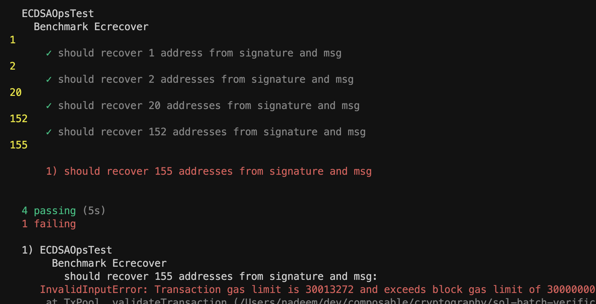

# Benchmarks

```shell
npx hardhat compile
npx hardhat node
npx hardhat run scripts/deploy.ts
npx hardhat test
forge test
```
## [Gas report](gas-report.txt)



Max signature count is 153, beyond which the transaction gas limit exceeds block gas limit of 30M

## Contract details

### EcdsaOps

> Contract includes encoding and hashing of message string, looping through each signature and recovering each address from the message hash and signature using `ECDSA.recover` function. Finally, an event is emitted with the number of correct matches.

### BenchEcrecover

> Contract for benchmarking ecrecover precompile using foundry's forge tests in `test/forge-test`.


